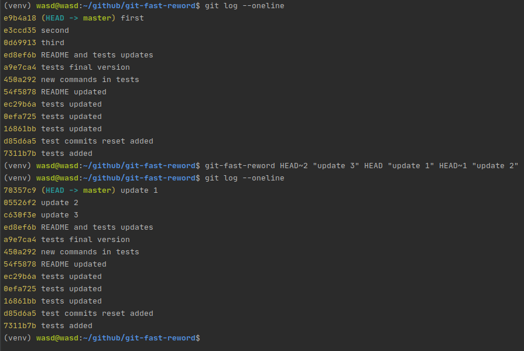

# git-fast-reword
Простой аналог git rebase --interactive с ограниченным функционалом. 
Для работы требуется pygit2.  
**Пример работы:**  
  
**Portable установка:**  
> export PATH=$PATH":$HOME/path/to/script"  

**Установка:**  
> echo 'export PATH=$PATH":$HOME/path/to/script"' >> .profile  

**Запуск тестов:**
> export PATH=$PATH":$HOME/path/to/tests_dir"  
> tiny-test-git-fast-reword  

На исходных кодах intellij тест работает долго, 
потому что долго выполняются коммиты и их удаление.  
**Тест:**
1) Делает $num_tests коммитов
2) Отображает через git log историю и ждёт выхода из git log
3) Выполняет git-fast-reword $num_tests раз
4) Отображает результат
5) Ждёт выхода из git log и удаляет коммиты
